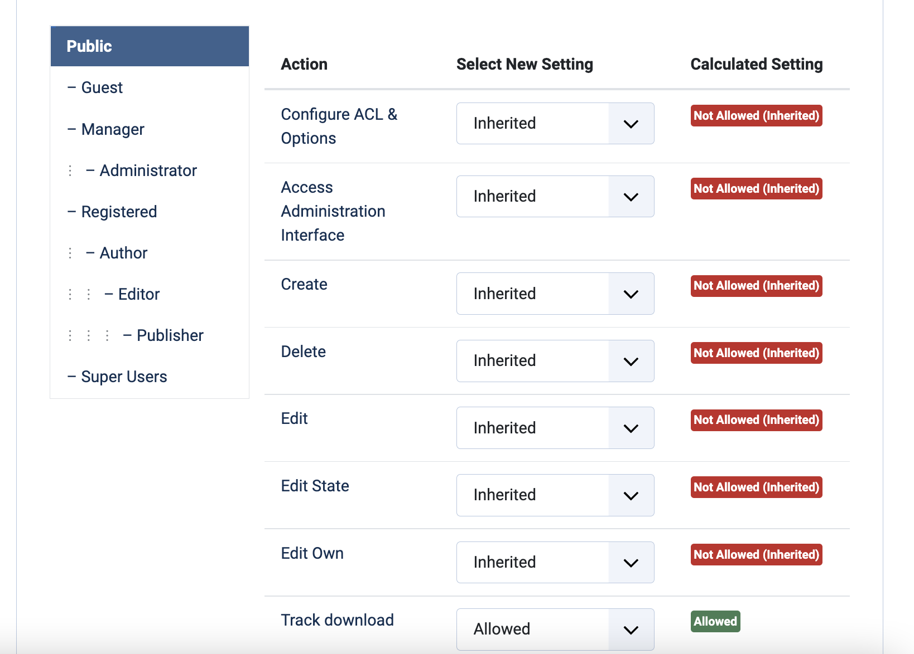

# Configuration settings

{: .no_toc }

  

    Table of contents
  

  {: .text-delta }
1. TOC
{:toc}

## General settings

This is not an exhaustive list of settings, but explains some of the main configuration options:
- Show main menu: by default, each _view_ shows a menu with links to the overview map, track list etc; this can be switched off
- Use categories/levels: J!TrackGallery offers the possibility to organise tracks in different 'Categories'. This is useful for websites that contain a lot of different tracks. For smaller sites, this may be superfluous and it can be switched off. Similarly, there is the possibility to indicate a difficulty level for each track, which can be suppressed as well.
- Several customisation options for the different views are organised in tabs in the configuration section

## Permissions

Permissions for uploading tracks, downloading GPX files and commenting are controlled in this panel. Permissions are set per user group. The Create, Edit, Delete permissions in J!Trackgallery control the creating, editing and deletion of GPX files and tracks. These permissions should only be given to authenticated users (i.e. users who are logged in to the website).

To give download permissions to users who are not logged in, give download permissions to 'Public', as shown below.

