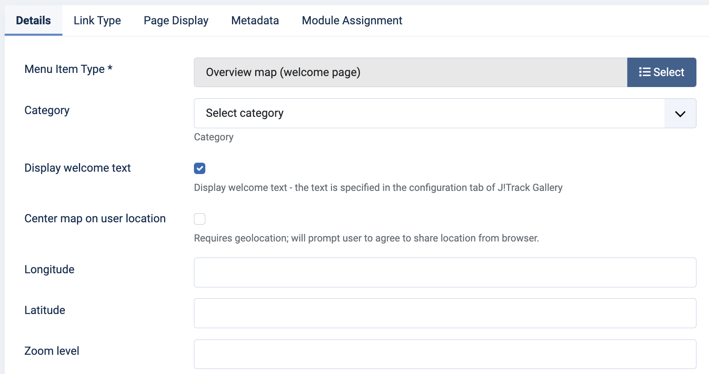

# Overview map

{: .no_toc }

  

    Table of contents
  

  {: .text-delta }
1. TOC
{:toc}

## Display options

The overview map one of the main pages of the J!Trackgallery component. Several aspects of it can be controlled in the administrator view, by creating a menu item, see the screenshot below (Joomla 4):

By default, the range of the map that is shown is automatically adjusted to show all the GPS tracks that are selected. However, it is also possible to set a customised view with the following options:
  - *Latitude* and *Longitude* specify the center of the map
  - *Zoom level* specifies the zoom level of the map (0-28); if no zoom level is set, the default value that is configured in the configuration menu is used
  - *Center on user location* uses geolocation from the user's browser to center the map on the user's current location. This also uses the specified zoom level. If no geolocation information can be obtained, the defaults are used.

There is also a configuration option to specify whether the welcome text should be shown or not.
